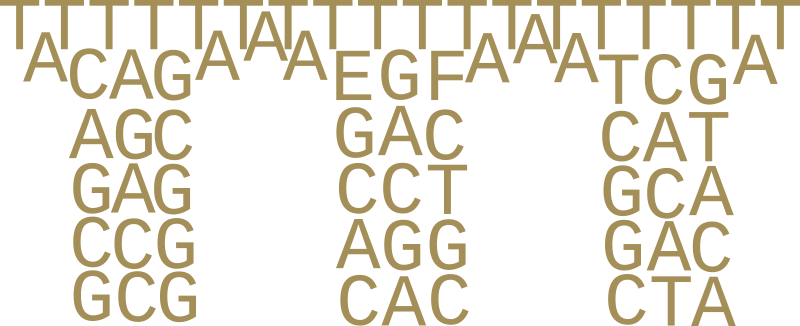

<p align="center">

</p>


# Sequeduct Methyl

Sequeduct Methyl is an extension to [Sequeduct](https://github.com/Edinburgh-Genome-Foundry/Sequeduct) as a stand-alone Nextflow analysis pipeline to validate cytosine methylations (5mC, 5hmC, or 4mC) or adenine methylations (6mA) in plasmids and DNA constructs.

A detailed demonstration is available under [demo](https://github.com/Edinburgh-Genome-Foundry/Sequeduct_Methyl/tree/main/demo).

## Usage

### Setup

Please be aware that the basecaller Dorado will only run with specific GPU requirements. Follow the recommendations by [Dorado](https://github.com/nanoporetech/dorado) regarding the supported systems for running the basecalling software before running Sequeduct Methyl. This is detailed in the 'Platforms' section in their GitHub.

Install the following software:

1. [Nextflow](https://www.nextflow.io/) to run the pipeline
2. [Dorado](https://github.com/nanoporetech/dorado) software version dorado-0.7.2-linux-x64 for basecalling
3. [SAMtools](https://github.com/samtools/samtools) (any version≥1.16) for indexing
4. [Modkit](https://github.com/nanoporetech/modkit) version 0.3.1 for creating a summary table of methylations

Make sure these software are available in your path. This can be done by running the command below to add each software to the `PATH` variable, taking Dorado as an example:

```bash
export PATH="$PATH:/path/to/dorado-0.7.2-linux-x64/bin"
```

Sequeduct Methyl was developed on Ubuntu 22.04 LTS and tested on a workstation with x86_64 CPU and NVIDIA RTX A4500 GPU. Additionally, check that all package dependencies are downloaded. Please be aware that this workflow was developed utilising Python package versions specified in the [requirements.txt](https://github.com/Edinburgh-Genome-Foundry/Sequeduct_Methyl/blob/main/requirements.txt) file. To ensure optimal performance, change package versions to those stated here.

Subsequently, run the following to download the Dorado basecalling model. This will be saved in your current directory.

```bash
dorado download --model dna_r10.4.1_e8.2_400bps_hac@v5.0.0
```

Pull the Sequeduct Methyl Nextflow pipeline:

```bash
nextflow pull edinburgh-genome-foundry/Sequeduct_Methyl -r v0.1.2
```

### Run

#### Analyse methylation readouts

Change to the directory you wish to create your pipeline analysis output in. Copy (or link) all raw read POD5 directories from Oxford Nanopore Sequencing runs to this specified directory. All directories should specify different barcodes/indexes from the run, and should be contained within a single parent directory whose path is used for the `--pod5_dir` parameter when running the analysis command below. Also include the path to the directory containing the reference GenBank-format files using `--genbank_dir`, sample sheet using `--sample_sheet` and parameter sheet using `--param_sheet`. The full path to the dorado model `dna_r10.4.1_e8.2_400bps_hac@v5.0.0` from the home directory should also be specified under `--model_path`. The project name can be altered using `--projectname`.

The following should be run on the command line:

```bash
nextflow run edinburgh-genome-foundry/Sequeduct_Methyl -r v0.1.2 -entry analysis \
    --pod5_dir='path/to/pod5_pass' \
    --genbank_dir='path/to/genbank_ref/dir' \
    --sample_sheet='path/to/sample_sheet.csv' \
    --param_sheet='path/to/parameter_sheet.csv' \
    --model_path='/full/path/to/dorado/model/directory' \
    --projectname='Methylation Project'
```

This command will create a new directory named `output` in the current working directory of the results. One final PDF report will be created, summarising the methylation analysis of all samples run in the pipeline. Additionally, Nextflow automatically creates a 'work' directory to store all pipeline products. Ensure that you do not already have a directory named 'work' in this same location before running.

Examples of both the sample sheet and parameter sheet are available under the [demo/sheets](https://github.com/Edinburgh-Genome-Foundry/Sequeduct_Methyl/tree/main/demo/sheets) directory. Through the parameter sheet, the thresholds for % methylations can be specified. This refers to the % of reads that are modified for that position to be deemed methylated, or unmethylated. Any positions with a % of reads between these two specified modification cutoffs are considered undetermined. Alongside this in the parameter sheet, specify the methylases whose patterns will be considered to identify methylated positions. The associated methylation pattern of the methylase is automatically identified. Multiple methylase enzymes can be specified separated by a space. The methylases available to choose from for (i) cytosine methylation are: AluI, BamHI, CpG, EcoKDcm, GpC, HaeIII, Hhal, HpaII, MspI for cytosine methylations, or 'MetC' can be specified to investigate all C positions, whilst the methylases available for (ii) adenine methylation are: EcoBI, EcoKDam, EcoKI, EcoRI, or TaqI, or EcoGII for investigating all A positions. For more detailed information, please consult [EpiJinn](https://github.com/Edinburgh-Genome-Foundry/EpiJinn).

### Details

The desired methylation modifications to be checked can be specified from the models 5mC_5hmC, 4mC_5mC, or 6mA using the `--model` parameter when running the pipeline. The default model is set to 5mC_5hmC. Optional methylation level thresholds parameters can also be specified, using `--mod_5mC_threshold` for the 5mC threshold, `--mod_5hmC_threshold` for the 5hmC threshold, `--mod_4mC_threshold` for the 4mC threshold and `--mod_6mA_threshold` for the 6mA threshold. If not specified, these methylation confidence thresholds are taken to be the optimised thresholds as specified in the nextflow.config file. 

Additionally, alongside the final PDF file with detailed analysis output, the HTML report version, aligned BAM file and bedMethyl files are also automatically saved in the output directory. If you desire to not save these two extra files, set their corresponding parameters (`--html_file`, `--aligned_bam` or `--bedMethyl` respectively) to 'false' when running the command below. If the additional FASTA reference file or sorted and indexed BAM files are desired, then their corresponding parameters (`--fasta_ref` or `--indexed_bam` respectively) can be set to 'true' when running the command below.

It is advised to pull the newest version of Sequeduct Methyl before analysis, and download the latest versions of dorado, modkit, and EpiJinn software.

#### Convert FAST5 files to POD5

If raw Oxford Nanopore Sequencing reads are in FAST5 format, the following can be run to convert these to POD5 files for Sequeduct Methyl.

First, install [Docker](https://www.docker.com/) and clone the repository:

```bash
git clone https://github.com/Edinburgh-Genome-Foundry/Sequeduct_Methyl.git
```

Then, build the Docker container:

```bash
docker build -f Sequeduct_Methyl/containers/Dockerfile --tag converter_docker .
```

Alternatively, those with access to EGF's container repository such as EGF staff, can pull the Docker image using the following:

```bash
docker pull ghcr.io/edinburgh-genome-foundry/sequeduct_methyl:v0.1.2
```

Subsequently, the command below is run to convert the FAST5 to POD5. Insert the path from your current directory to the sample sheet using `--sample_sheet` and the full path to the main directory containing subdirectories for each sample with FAST5 files using `--fast5_dir`.

```bash
nextflow run edinburgh-genome-foundry/Sequeduct_Methyl -r v0.1.2 -entry converter \
    --sample_sheet 'path/to/sample_sheet.csv' \
    --fast5_dir '/full/path/to/fast5_pass' \
    -with-docker converter_docker
```

A `pod5_pass` directory will be created in the directory used for `--fast5_dir` that contains the POD5 file outputs in their corresponding sample directory name. This `pod5_pass` directory should be used as input for `--pod5_dir` when running the analysis as stated [above](https://github.com/Edinburgh-Genome-Foundry/Sequeduct_Methyl/tree/main?tab=readme-ov-file#convert-fast5-files-to-pod5).

## Demonstration

An additional [README.md](https://github.com/Edinburgh-Genome-Foundry/Sequeduct_Methyl/tree/main/demo/README.md) is available that demonstrates the use of Sequeduct Methyl with example data and output interpretation. There are also extra details regarding parameters that can be set by the user when running the pipeline.

## License = GPLv3+

Copyright 2024 Edinburgh Genome Foundry, University of Edinburgh. Sequeduct Methyl is implemented by [Jennifer Claire Muscat](https://github.com/jennycmuscat).