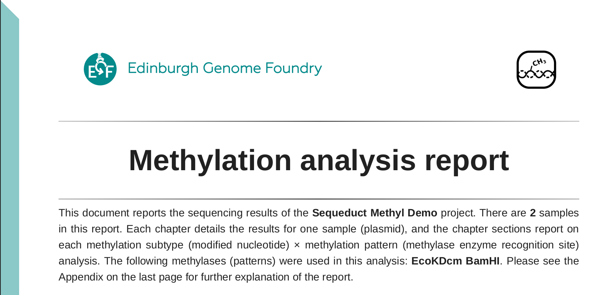
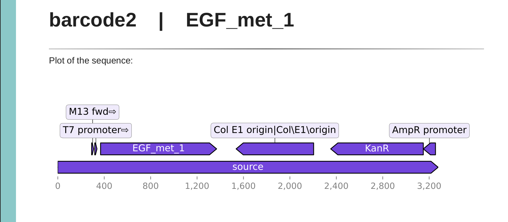
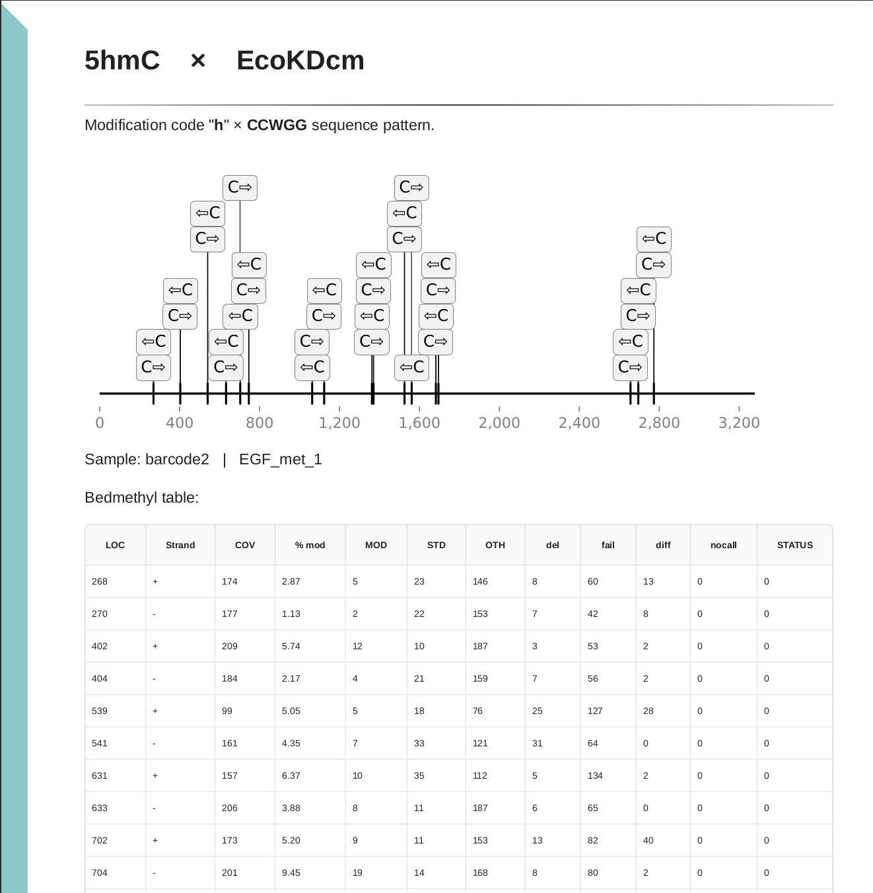
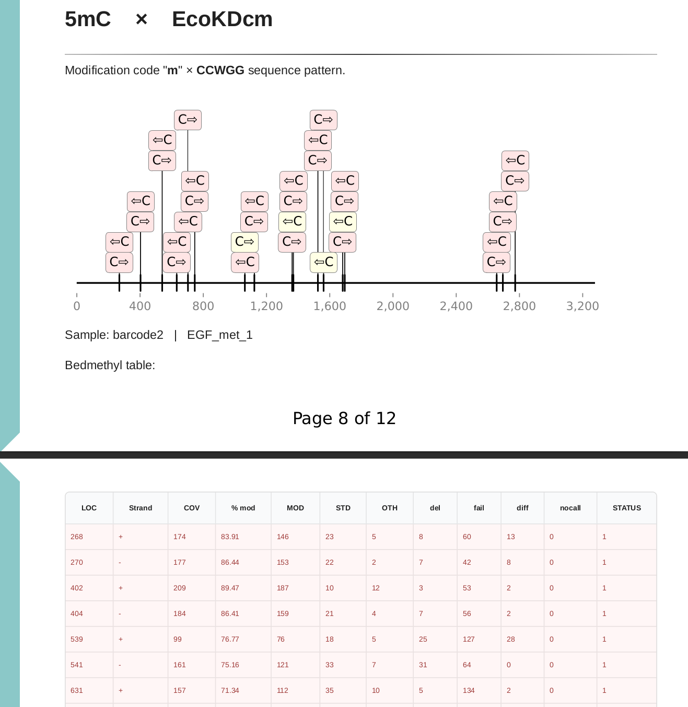
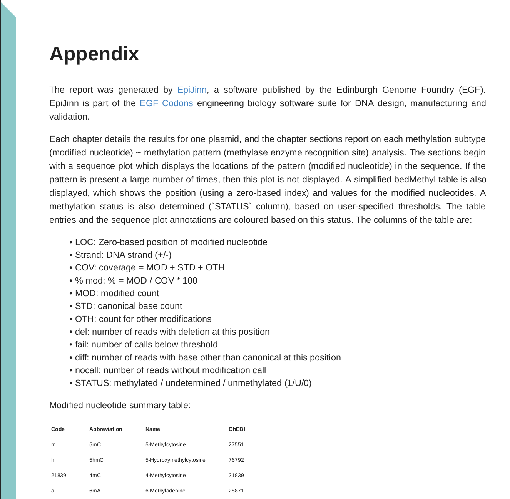

# Sequeduct Methyl Demonstration

This outlines a demonstration of the pipeline Sequeduct Methyl with example input data, as well as an interpretation of the outputs. 

All extra files required for a demonstration run of Sequeduct Methyl are available under the directory `demo`, including sample [POD5 data](https://github.com/Edinburgh-Genome-Foundry/Sequeduct_Methyl/tree/main/demo/pod5_pass) and the reference [GenBank-format file](https://github.com/Edinburgh-Genome-Foundry/Sequeduct_Methyl/blob/main/demo/genbank/EGF_met_1.gb).

## Run

Sequeduct Methyl requires four input files in total. The `pod5_dir` and GenBank-format reference file from the [demo](https://github.com/Edinburgh-Genome-Foundry/Sequeduct_Methyl/tree/main/demo) directory should be downloaded in a directory you wish to run the pipeline from. Additionally, download the `sample_sheet.csv` and `param_sheet.csv` from the [sheets](https://github.com/Edinburgh-Genome-Foundry/Sequeduct_Methyl/tree/main/demo/sheets) directory, and then the following can be run. Note that `--model_path` requires the full path to the basecalling model `dna_r10.4.1_e8.2_400bps_hac@v5.0.0` by [Dorado](https://github.com/nanoporetech/dorado).

```bash
nextflow run edinburgh-genome-foundry/Sequeduct_Methyl -r v0.1.2 -entry analysis \
    --pod5_dir='./pod5_pass' \
    --genbank_dir='./genbank' \
    --sample_sheet='./sheets/sample_sheet.csv' \
    --param_sheet='./sheets/parameter_sheet.csv' \
    --model_path='/full/path/to/dorado/model/directory' \
    --projectname='Sequeduct Methyl Demo'
```

This demo run uses the 5mC_5hmC Dorado basecaller model that identifies 5mC and 5hmC cytosine methylations. The final PDF report identifies DNA regions containing the patterns of the methylases EcoKDcm (CCWGG) and BamHI (GGATCC).

## Output

Results files are saved in a new directory in your current working directory named `output`. By default, these output files include the [aligned BAM file](https://github.com/Edinburgh-Genome-Foundry/Sequeduct_Methyl/blob/main/demo/output/barcode1/barcode1_aln.bam) per barcode, [bedMethyl table file](https://github.com/Edinburgh-Genome-Foundry/Sequeduct_Methyl/blob/main/demo/output/barcode1/barcode1_EGF_met_1.bed) per barcode, and final [PDF report](https://github.com/Edinburgh-Genome-Foundry/Sequeduct_Methyl/blob/main/demo/output/EpiJinn_report.pdf) for all barcodes. 

The PDF report is structured into sections for each sample (barcode), with subsections containing methylation visualisations per modification type per methylase pattern. A description of the sections is outlined below.

The cover page appears at the front, detailing the project name, the number of samples analysed, and the investigated methylase patterns:

<p align="center">

</p>

Taking barcode 2 as an example, this section opens with an illustration of the main components present in the sample plasmid, including base positions across the sequence.

<p align="center">

</p>

Using the methylase EcoKDcm as an example, the following shows the methylation illustrations for barcode 2. Both 5hmC and 5mC modifications are identified and reported separately. Each cytosine base present within every EcoKDcm methylation site sequence, CCWGG, contains a box with a C as shown below. The arrow represents the strand that the cytosine is present on (forward or backward strand). The figure is colour-coded to show methylated (red), undetermined (yellow), or unmethylated (grey) cytosine positions. These categories are set by the methylation thresholds set in the [parameter sheet](https://github.com/Edinburgh-Genome-Foundry/Sequeduct_Methyl/blob/main/demo/sheets/param_sheet.csv). A bedMethyl table is also included below each illustration with corresponding cytosine positions for all CCWGG sequences in the plasmid.

<p align="center">

</p>

It is expected that all cytosines do not flag up as methylated with the 5hmC modification, as this methylation is not typically native to bacteria.

<p align="center">

</p>

5mC modifications, however, are present in bacterial plasmids, and so this illustration shows cytosines that have been labelled as methylated by containing over 70% of reads modified. Four cytosine positions have an undetermined modification status due to an insufficient percentage of reads being modified.

This is also repeated for results for the BamHI methylase with barcode 2, as this was specified in the parameter sheet. The full [PDF report](https://github.com/Edinburgh-Genome-Foundry/Sequeduct_Methyl/tree/main/demo/output/EpiJinn_report.pdf) can be viewed to see all sample, modification type, and methylase sections.

<p align="center">

</p>

The final page contains an Appendix that further explains the structure of the report and a description of all abbreviations used.

## Interpreting Pipeline Results

* Inspect both the bedMethyl file saved for each barcode and sample, for example `barcode1_EGF_met_1.bed` as well as the final PDF report `EpiJinn_report.pdf`.
* Review the main components constituting the reference plasmid from the 'plot of the sequence' per sample in the PDF report and compare this to the plasmid map of the reference GenBank-format file on a sequence editor.
* Observe the plots illustrating the methylated positions in the plasmid sequence per barcode. Each plot includes all methylation pattern of the specified methylase found in the plasmid. Patterns continaing a methylated base are shown in red, whilst bases with undetermined modification statuses are shown in yellow. Arrows refer to the strand the modification is present on.
* Locate the methylated positions per barcode shown in red (with status '1') and the undetermined positions in yellow (with status 'U'). Patterns labelled as unmethylated in grey are marked with status '0'. Match the location of the methylated positions stated in the bedMethyl tables to the reference sequence plot to identify the regions of the plasmid that the modifications occur in, taking the strand into consideration.
* Take note of the coverage for the positions marked as methylated (in red) in the PDF report. Positions with a methylated status that contain a low coverage may not reflect a genuine modified position. Therefore, positions with coverages below a chosen threshold may excluded from being classified as methylated due to this uncertainty. 
* Utilise bedMethyl files for any further analysis desired. Only positions that contain a base status other than the canonical form from least one read are included in this file. Columns in the bedMethyl file correspond to the below, respectively. More information regarding these fields can be found on [Modkit's GitHub](https://github.com/nanoporetech/modkit).

| chrom |   start position |    end position|   modified base code and motif |  score | strand |    start position |    end position |	color | Nvalid_cov |    percent_modified |  Nmod |  Ncanonical | Nother_mod | Ndelete |  Nfail |  Ndiff |    Nnocall |
| :---: | :---: | :---: | :---: | :---: | :---: | :---: | :---: | :---: | :---: | :---: | :---: | :---: | :---: | :---: | :---: | :---: | :---: |

* Nmod is of interest for assessing methylated base positions, as it refers to the number of reads that contain the specified modification in the basecalling model (such as 5mC) per position. 

## Setting Additional Parameters

Besides the parameters specified above, there are additional optional parameters that can be set by the user. The full list of default parameters can be found in the [nextflow.config](https://github.com/Edinburgh-Genome-Foundry/Sequeduct_Methyl/blob/main/nextflow.config) file.

* `--mod_5mC_threshold`, `--mod_5hmC_threshold`, `--mod_4mC_threshold` and `--mod_6mA_threshold` correspond to the confidence score threshold of each read to be classified as methylated for 5mC, 5hmC, 4mC or 6mA respectively.

* `--parallel_runs` controls the number of samples that are run in parallel for the runDorado step in the [analysis.nf](https://github.com/Edinburgh-Genome-Foundry/Sequeduct_Methyl/blob/main/nextflow/analysis.nf) Nextflow pipeline. If you encounter an issue regarding GPU memory running at capacity, consider decreasing this value. If your device can handle running many samples in parallel, increase this value to speed up the process.

* `--dorado_batchsize` refers to the batch size used when carrying out Dorado, and can be adjusted depending on your GPU memory. Higher RAM can deal with a higher batch size, so increasing this value can speed up the process. This is set to a default to prevent Dorado from testing each batch size to select an appropriate one. Refer to [Dorado](https://github.com/nanoporetech/dorado) for more information.

* `--dorado_device` refers to the GPU utilised by Dorado. This is set by default to cuda:0, meaning it will run on the first CUDA-enabled GPU available. Modify this parameter to select the memory device available on your system. Refer to [Dorado](https://github.com/nanoporetech/dorado) for more information.

* `--fasta_ref` and `--indexed_bam` can be set to "true" if you wish to save the FASTA reference file generated from the reference GenBank-format file, or the indexed BAM file respectively.

* `--aligned_bam`, `--bedMethyl`, and `--html_file` can be set to "false" if you do not wish to save the aligned BAM file, bedMethyl table files, or the final HTML report respectively.

Moreover, the [parameter sheet](https://github.com/Edinburgh-Genome-Foundry/Sequeduct_Methyl/blob/main/examples/param_sheet.csv) included as input through the `--param_sheet` parameter is utilised by the Python package [EpiJinn](https://github.com/Edinburgh-Genome-Foundry/EpiJinn/tree/main). It includes the methylation threshold for the proportion of all reads at each position required to classify the position as methylated (above `methylated_cutoff`), unmethylated (below `unmethylated_cutoff`), or undetermined (between `methylated_cutoff` and `unmethylated_cutoff`). These can be altered to be more stringent or lenient as you desire. The `methylases` parameter contains the methylases to consider the methylation patterns of. Methylations present in these methylase patterns will be identified and flagged. This parameter can take one or multiple methylases separated by a space.

Copyright 2024 Edinburgh Genome Foundry, University of Edinburgh